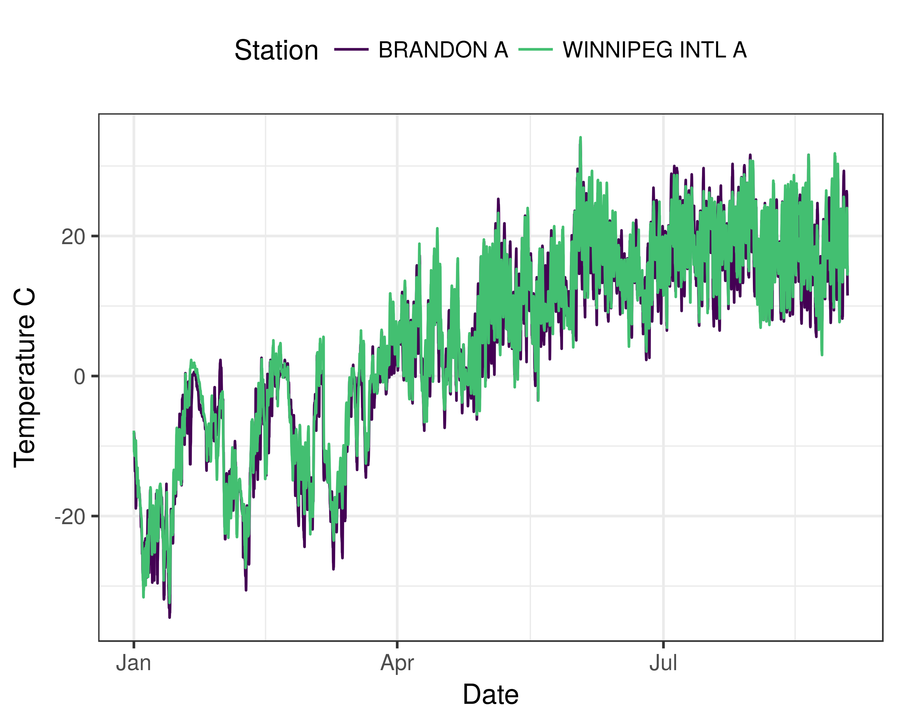

# Summary

Environment and Climate Change Canada maintains an online source of historical Canadian weather data in hourly, daily and monthly formats for various stations across Canada [@canada_historical_2011]. This data is freely available and can be accessed directly from their website. However, downloading data from multiple stations and across larger time periods can take significant time and effort. Further, these downloads require processing before they can be used for analysis. `weathercan` [@lazerte_weathercan_2018] is an R [@r_stats] package that automates and simplifies the downloading and formating of this data.

The first step in using `weathercan` is to identify the station ID(s) of the weather station(s) of interest. Stations can be searched for either by name or proximity to a given location. Searches can be conducted on all possible stations, or filtered to include only those recording weather at the desired time interval. Next, weather data can be downloaded for the specified stations, time range and time interval (i.e. hours, days, months). Data downloaded from multiple stations and over several months are automatically combined into one data frame ready for analysis or plotting (Figure 1). Finally, weather data from a single station can be aligned and merged with existing datasets through linear interpolation.

Figure 1. Data downloaded with `weathercan` is formated and ready for ploting.

`weathercan` is available on GitHub at <https://github.com/ropensci/weathercan>

# References
